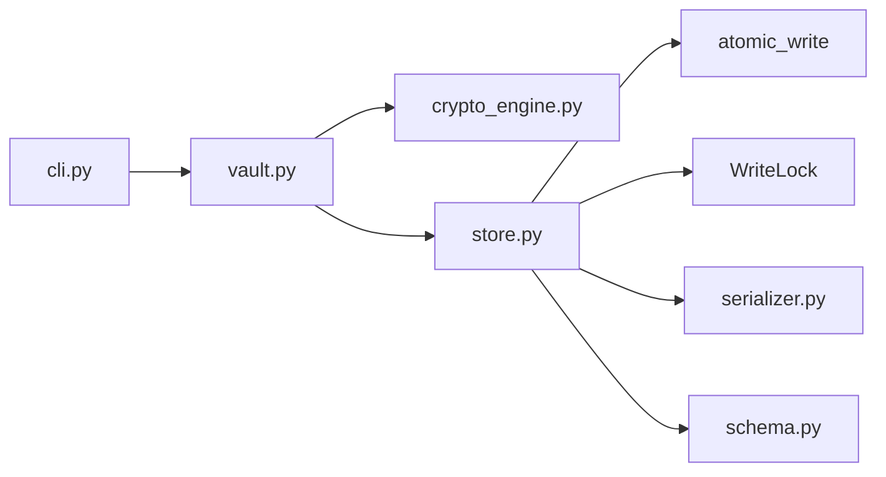

# Local Password Manager

[](https://www.python.org/downloads/)
[](LICENSE)
[](https://github.com/PrincetonAfeez/Password-Manager/actions/workflows/ci.yml)

A **local-only** encrypted password vault for coursework and portfolio use: scrypt +
Fernet via a single auditable crypto module, schema-validated storage, atomic writes,
and a safe CLI that never puts the master password on the command line.

## Why this project

- **Structural security** — only `crypto_engine.py` imports `cryptography`; enforced by tests.
- **Fail-closed** — bad decrypt, parse, or schema → no use of vault data.
- **Honest limits** — documented threat model (memory, metadata, timing); no false claims.

## Architecture



Details: [`docs/ARCHITECTURE.md`](docs/ARCHITECTURE.md) · ADRs: [`docs/adr/`](docs/adr/) · Report: [`docs/REPORT.md`](docs/REPORT.md)

## Quick demo

```powershell
python -m pip install -e .

python -m password_manager --vault demo.pwv init
# New master password: (12+ characters)
# Confirm master password:

python -m password_manager --vault demo.pwv add github --username you --generate --length 20
# Master password:
# (password is generated; nothing echoed)

python -m password_manager --vault demo.pwv list
# Master password:
# → table of IDs / services (no secrets)

python -m password_manager --vault demo.pwv get github --reveal
# Master password:
# → password line shows generated secret

python -m password_manager --vault demo.pwv check
# Master password:
# → OK: vault decrypted and validated
```

Golden fixture (no setup): `tests/fixtures/golden.pwv` with master password `golden-password`.

## Install

```powershell
python -m pip install -e ".[dev]"
```

Primary entry point (works without PATH):

```powershell
python -m password_manager --help
```

Optional script after install: `pwvault` (requires Python Scripts directory on `PATH`).

## CLI commands

| Command | Purpose |
| --- | --- |
| `init` | Create vault (refuses if file exists) |
| `add` | Add entry (`--generate` for password, `--notes-prompt` for notes) |
| `list` | Safe summaries only |
| `get` | View entry (`--reveal`, `--details`) |
| `update` | Partial update (`--generate`, `--password-prompt`, `--notes-prompt`) |
| `delete` | Remove entry (`--yes` to skip prompt) |
| `search` | Match service, username, url, notes |
| `check` | Verify master password (no unlocked session) |
| `lock` | Verify the master password and exit (no session is kept) |
| `change-password` | Rotate master password + salt (KDF upgrade: library API only) |
| `generate` | Standalone password (no vault) |

### Exit codes

| Code | Meaning |
| --- | --- |
| 0 | Success (includes a cancelled `delete`) |
| 1 | Vault error, validation error, or ambiguous entry |
| 2 | Usage error (bad arguments; emitted by argparse) |
| 130 | Interrupted (Ctrl-C) |

Master password: **minimum 12 characters**, never passed as a CLI argument.
Generated entry passwords (via `--generate`) share the same 12-character minimum.
Manually entered entry passwords require only non-empty text.

`--notes-prompt` (on `add`/`update`) reads the value via `getpass`, so the
input is hidden from the terminal — notes can contain recovery codes, 2FA
seeds, or other secrets and shouldn't be echoed.

## Library usage

Returned `Entry`/`VaultHeader` objects are immutable copies. To change an entry,
call `update_entry(id, EntryUpdate(...))` — mutating a returned object has no
effect on the vault.

`initialize()` leaves an unlocked in-memory session; call `lock()` afterward if
you do not need one. KDF cost upgrades during master-password rotation are available
via `Vault.change_master_password(..., kdf_params=...)` (library API only; not in CLI).

## Security design

| Layer | Responsibility |
| --- | --- |
| `crypto_engine.py` | Only module that imports `cryptography` |
| `VaultStore` + `atomic_write` | Temp file, fsync, `os.replace`, directory fsync |
| `WriteLock` | Same-directory lock; stale lock cleanup |
| `VaultSchema` | KDF bounds, entry shape, size limits |
| `Vault` | Fail-closed decrypt; revision checks; session rules |
| CLI | Masked output, `getpass`, write lock for mutating commands |

See [`SECURITY.md`](SECURITY.md) for reporting and scope.

### Master password policy

Minimum **length 12** only (documented trade-off for scope). Users should still choose
high-entropy passphrases; offline attacks remain feasible with weak passwords.

### Authentication failures

Wrong password and corrupted ciphertext both raise `DecryptionError` with the same
safe message ([ADR 0005](docs/adr/0005-no-password-verifier.md)). Timing side channels
are not mitigated.

Failed re-authentication on `unlock()`, `verify_password()` / `check`, and
`change_master_password()` clears any unlocked in-memory session (fail-closed; library
API). The CLI uses a fresh `Vault` per command, so no session persists between invocations.

## Test map

See [`tests/README.md`](tests/README.md) for the full module-to-test mapping. Highlights:

| Claim | Test module |
| --- | --- |
| Crypto round-trip / tamper | `test_crypto_engine.py`, `test_crypto_engine_complete.py` |
| Single cryptography import | `test_security.py` |
| Atomic write safety | `test_atomic.py`, `test_atomic_complete.py` |
| Schema / serializer | `test_serializer_schema.py`, `test_schema_limits.py`, `test_schema_complete.py` |
| Property round-trip | `test_serializer_property.py` |
| Vault lifecycle / session | `test_vault_lifecycle.py`, `test_vault_session.py`, `test_vault_complete.py` |
| Revision conflict | `test_revision.py` |
| Golden fixture | `test_golden_vault.py` |
| CLI safety | `test_cli.py`, `test_cli_helpers.py` |

```powershell
python -m pytest
# Coverage gate: >= 90% on password_manager package (see tests/README.md)
```

## Vault format

```json
{
  "header": {
    "format": "py-password-vault",
    "version": 1,
    "revision": 0,
    "kdf": "scrypt",
    "kdf_params": { "length": 32, "n": 16384, "r": 8, "p": 1 },
    "salt": "base64-encoded-salt",
    "cipher": "fernet",
    "created_at": "2026-05-26T12:00:00+00:00",
    "updated_at": "2026-05-26T12:00:00+00:00"
  },
  "body": "fernet-token-as-text"
}
```

## Threat model (short)

**Protects:** offline file read without master password, ciphertext tampering, accidental
CLI secret exposure, partial write corruption, casual concurrent CLI overwrites.

**Does not protect:** malware, keyloggers, shoulder surfing, memory scraping, weak
master passwords, dependency compromise, vault deletion.

**Visible metadata:** header fields, file size, mtime, Fernet token timing.

## Lessons learned

1. **Isolate crypto** — one module makes “don’t roll your own” a structural rule.
2. **Fail closed** — if decrypt or validation fails, never partially trust data.
3. **Document limits** — CPython cannot wipe strings; say so in README and ADRs.

## Project docs

| Document | Audience |
| --- | --- |
| [docs/ARCHITECTURE.md](docs/ARCHITECTURE.md) | Developers / graders |
| [docs/REPORT.md](docs/REPORT.md) | Academic submission |
| [CHANGELOG.md](CHANGELOG.md) | Version history |
| [CONTRIBUTING.md](CONTRIBUTING.md) | Contributors |
| [docs/password_manager_improved_full_scope_no_django.txt](docs/password_manager_improved_full_scope_no_django.txt) | Historical scope (superseded) |

## Development

```powershell
python -m pip install -e ".[dev]"
python scripts/generate_golden_vault.py
ruff check password_manager tests
mypy password_manager
python -m pytest
pre-commit run --all-files
```

Version-bounded dev requirements: [`requirements-dev.txt`](requirements-dev.txt).
Exact pins for reproducible grading: [`requirements-lock.txt`](requirements-lock.txt)
(`pip install -r requirements-lock.txt && pip install -e .`). CI also runs a lockfile
install job on Python 3.12 (see [`.github/workflows/ci.yml`](.github/workflows/ci.yml)).

CI: Python 3.10 & 3.12 on Ubuntu, Windows, and macOS — ruff, mypy, pytest with coverage,
pre-commit, and lockfile verification (see [`.github/workflows/ci.yml`](.github/workflows/ci.yml)).

## License

MIT — see [LICENSE](LICENSE). Copyright (c) 2026 Princeton Afeez.
