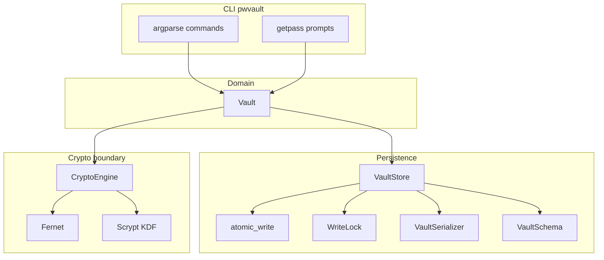
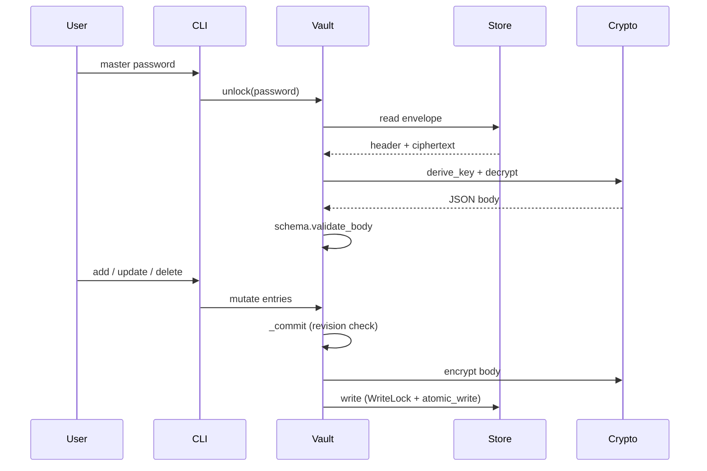

# Architecture

## Overview

`local-password-manager` is a **library-first** design: the `Vault` domain type owns
business rules; the `pwvault` CLI is a thin, safe wrapper. All cryptographic primitives
live behind a single module so reviewers can audit one file.

## Unlock → mutate → save

## Layer responsibilities

| Layer | Module(s) | Role |
| --- | --- | --- |
| CLI | `cli.py` | Parsing, masked output, `getpass`, write-lock scope for mutating commands |
| Domain | `vault.py` | Session state, CRUD, master-password rotation, revision conflicts |
| Crypto | `crypto_engine.py` | **Only** importer of `cryptography` |
| Serialization | `serializer.py` | Stable JSON for header/body/envelope |
| Validation | `schema.py` | KDF bounds, entry shape, size limits |
| Storage | `store.py`, `atomic.py`, `lockfile.py` | Read/write file, atomic replace, inter-process lock |

## Secrets in memory

- Master and entry passwords exist as Python `str` in the CLI and `Vault` during a session.
- `lock()` clears references to header, body, and key; CPython does not guarantee wiping.
- `verify_password()` / `check` decrypt on disk without loading a session when the vault was locked.

## Concurrent access

1. **Write lock file** — same directory as the vault; reentrant in one thread (CLI + `VaultStore`).
2. **Header `revision`** — incremented on every persist; stale in-memory copies get `VaultConflictError`.

See [ADR 0009](adr/0009-concurrent-writer-policy.md).

## Related documents

- [README](../README.md) — usage and threat model
- [REPORT.md](REPORT.md) — academic submission summary
- [adr/](adr/) — design decisions
